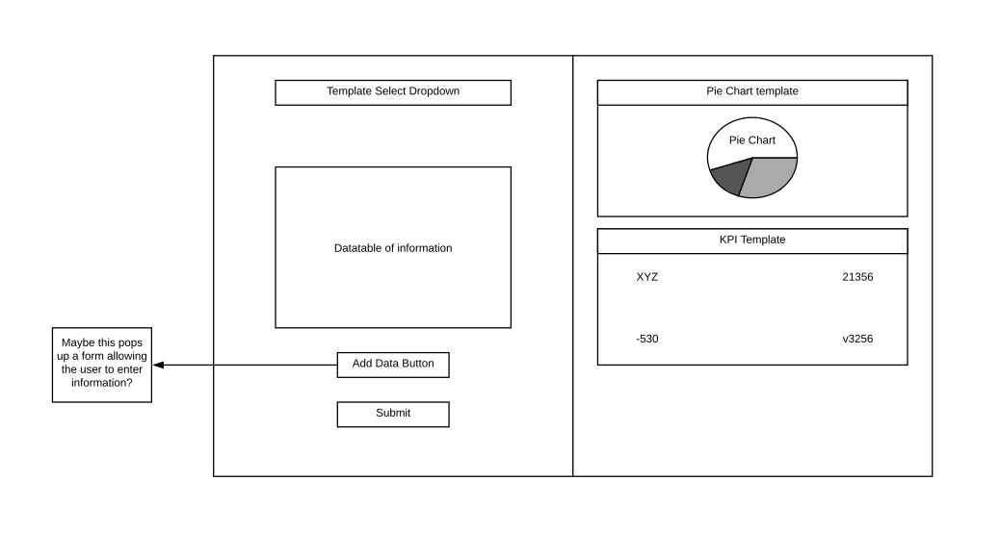

# Datakwip Frontend Test

The Task:
Datakwip is looking for a new frontend engineer to take our cloud platform to the next level. This engineer would rebuild our current html, CSS, and JavaScript web application with newer technology such as React or Vue.

This test app is designed to be a straightforward in order to make sure our applicants can code React or Vue.

The App:
The app will be a single page that is split vertically into two parts. On the left, there will be an area to type information, and on the right will be results. The idea of this app is that a user can select a template drop a drop down, enter some information, and then hit submit. Once submitted, the app will render the information submitted on a graphic, chart, kpi, etc. on the right side of the screen. The user should be able to enter the same info, select a different template and see that information displayed with the new template on the right side. Besides the above functionality written above, the only other requirements are that it is written in React or Vue and that you have a minimum of 3 template options. When it comes to rendering a graphic, I recommend a free chart library such as
AmCharts, Chart.js, etc. We are trying to keep the requirements to a minimum so that your creativity in coding will show.

Below I have a sample wireframe of the application. to change it up however you see fit.

This project was bootstrapped with [Create React App](https://github.com/facebook/create-react-app).

## Available Scripts

In the project directory, you can run:

### `npm start`

Runs the app in the development mode. 
Open [http://localhost:3000](http://localhost:3000) to view it in the browser.

The page will reload if you make edits. 
You will also see any lint errors in the console.

### `npm test`

Launches the test runner in the interactive watch mode. 
See the section about [running tests](https://facebook.github.io/create-react-app/docs/running-tests) for more information.

### `npm run build`

Builds the app for production to the `build` folder. 
It correctly bundles React in production mode and optimizes the build for the best performance.

The build is minified and the filenames include the hashes. 
Your app is ready to be deployed!

See the section about [deployment](https://facebook.github.io/create-react-app/docs/deployment) for more information.

### `npm run eject`

**Note: this is a one-way operation. Once you `eject`, you can’t go back!**

If you aren’t satisfied with the build tool and configuration choices, you can `eject` at any time. This command will remove the single build dependency from your project.

Instead, it will copy all the configuration files and the transitive dependencies (webpack, Babel, ESLint, etc) right into your project so you have full control over them. All of the commands except `eject` will still work, but they will point to the copied scripts so you can tweak them. At this point you’re on your own.

You don’t have to ever use `eject`. The curated feature set is suitable for small and middle deployments, and you shouldn’t feel obligated to use this feature. However we understand that this tool wouldn’t be useful if you couldn’t customize it when you are ready for it.

## Learn More

You can learn more in the [Create React App documentation](https://facebook.github.io/create-react-app/docs/getting-started).

To learn React, check out the [React documentation](https://reactjs.org/).

### Code Splitting

This section has moved here: https://facebook.github.io/create-react-app/docs/code-splitting

### Analyzing the Bundle Size

This section has moved here: https://facebook.github.io/create-react-app/docs/analyzing-the-bundle-size

### Making a Progressive Web App

This section has moved here: https://facebook.github.io/create-react-app/docs/making-a-progressive-web-app

### Advanced Configuration

This section has moved here: https://facebook.github.io/create-react-app/docs/advanced-configuration

### Deployment

This section has moved here: https://facebook.github.io/create-react-app/docs/deployment

### `npm run build` fails to minify

This section has moved here: https://facebook.github.io/create-react-app/docs/troubleshooting#npm-run-build-fails-to-minify
